# Mechanical CAD edit model and verification pipeline

The trained component predicts a program/command patch. Actual CAD execution and
FEM are external tools. A decoder cannot declare an engineering edit verified.

```mermaid
flowchart LR
 D[Online paired CAD edits] --> S[Preserve source splits and connected components]
 S --> C[Representation-aware canonical lines and JSON patches]
 C --> T[Completion-only LoRA training]
 T --> P[Instruction plus original CAD to predicted patch]
 P --> A[Schema, bounds and syntax validation]
 A --> G[Execute CadQuery or native sketch/extrude sequence]
 G --> V[STEP solid and linked SVG views]
 V --> F[Explicit physical contract and tetrahedral FEM]
 F --> Q[Equilibrium, mesh sensitivity and response checks]
 Q --> R[Separate geometry, physics and failure verdicts]
```



## Online paired-edit data

1. **BenchCAD**: https://huggingface.co/datasets/BenchCAD/BenchCAD.
   Published CadQuery source/target pairs and released STEP references; CC-BY-4.0.
   Preserve the earlier family/template-component split and context-retained rows.
2. **Microsoft CAD-Editor**: https://github.com/microsoft/CAD-Editor.
   Official `data/processed.zip`, SHA-256
   `98d01e2b1881f44f38518e43cad7796904ce4a795785569f3e48b87160107f4f`.
   Its archive contains 120,000 train and 2,000 test entries. Use the audited
   2,048/128/128 bounded subset, preserving exact source/target connected components
   and excluding components that touch upstream test from train/validation.
   Follow upstream and underlying source-model terms; repository MIT code licensing
   alone does not settle every underlying CAD-model right.

The combined prepared split has 2,540 training, 172 validation and 252 test rows:
492/44/124 BenchCAD and 2,048/128/128 CAD-Editor. Two additional BenchCAD held-out
instructions mentioning excluded pipe subjects are removed and recorded. This is
a local multi-source protocol, not either official leaderboard. It preserves
native representations; no fictitious sequence-to-Python labels are generated.
No native design-ID bridge proves cross-source geometric ancestry isolation.
The six existing FEM example cases are held out and never used as training data,
physics labels, hyperparameter selection or a solver reward.

Autodesk neuralCAD-Edit was reviewed as a further expert benchmark. Its released
Fusion/BRep expert edits are not equivalent to paired CadQuery source programs;
no expert script labels are invented or counted as training pairs here. Native
Fusion action reconstruction is a separate adapter requirement.

## Trainable model

Fresh **Qwen2.5-Coder-3B-Instruct**, using Colab GPU QLoRA with 4-bit NF4 double quantization. T4 uses FP16 computation; capable GPUs use BF16. Completion-only causal-LM
loss; LoRA rank 16, alpha 320 (scale 20), dropout zero, all seven attention/MLP
linear projections in the last 12 transformer blocks. Two fixed epochs, effective batch
four (T4 microbatch one with four accumulation steps), seed 17, constant learning rate 1e-4, 4,096 total-token context and
768-token target/generation cap. Token overflows are explicitly omitted, never
silently truncated. The final saved adapter is reloaded for greedy evaluation;
no test-based checkpoint selection is performed. Before/final predictions cover
all retained test records and metrics are separated by dataset and representation.

The model returns only `{"edits":[{"start":0,"delete":1,"insert":["..."]}]}`.
Indices refer to original canonical lines. BenchCAD lines are Python code;
CAD-Editor lines are native commands/markers. Strict syntax checks and bounds
checks are representation-specific. FEM is post-edit verification, not a
training reward, differentiable loss or text label predicting solver success.

## Geometry and FEM checks

`cad_editor_geometry.py` reconstructs the official six-bit sketch/extrude format
through CadQuery/OCP, using the author's dequantization, basis and Boolean
conventions. CAD-Editor target solids are locally reconstructed references;
BenchCAD references remain independently downloaded STEP files. A kernel-valid
solid or exact sequence match alone is not physical verification.

`run_verified_cad_edit.py` requires a physical contract before FEM. It applies
a predicted patch, validates/executes the result, exports STEP and linked SVGs,
meshes with Gmsh, solves 3D linear isotropic elasticity with first-order tetrahedra
and SciPy sparse linear algebra, and saves raw displacement/stress fields in NPZ
and VTU for inspection. Optional target STEP comparison combines solid IoU and
compliance response agreement. Numerical force/moment equilibrium, free residual,
energy identity, CAD/mesh volume fidelity and mesh sensitivity remain separate.

The supplied example contract assumes mm/N/MPa, E=210,000 MPa, nu=0.3, a 1 N load,
and geometric end-band fixtures. These are explicit synthetic scenarios, not
released operating conditions. The rotation example co-rotates its fixture/load
axis. Native normalized CAD-Editor shapes additionally require an explicit
`native_length_scale_mm`. Missing contracts, unanchored components, meshing
failures and unconverged responses remain **not verified**. No shape repair,
component fusion, contact condition or strength limit is invented to pass a case.
Peak stress is diagnostic; compliance convergence does not establish stress
convergence, yield strength, buckling, fatigue, contact or operational safety.

## Reproduction

```sh
# Build the multi-source paired-edit corpus from pinned local online-source caches.
cvpr2027/tmp/mechanical-training/bin/python cvpr2027/scripts/build_multisource_cad_edits.py

# Train on a CUDA host with torch/transformers/peft; choose an available GPU.
CUDA_VISIBLE_DEVICES=0 python cvpr2027/scripts/train_multisource_cad_cuda.py \
  --data cvpr2027/data/multisource-cad-edits-v1 --output runs/new-multisource-cad-model

# Apply a saved model patch and execute CAD + contracted FEM.
cvpr2027/tmp/cad-runtime/bin/python cvpr2027/scripts/run_verified_cad_edit.py \
  --source original.py --patch predicted-patch.json --representation cadquery \
  --contract cvpr2027/configs/mechanical-fem-test-contract.json \
  --target-step target.step --output runs/new-verified-edit
```

For actual engineering assessment, substitute the specified units, material,
load case, supports and engineering limits. The generic end-band scenario is
not evidence that the part is suitable for its real application.

## Colab execution

Open `notebooks/Mechanical_CAD_Multisource_FEM_Train.ipynb` in Colab and select a GPU. The notebook embeds audited public data and scripts, runs training, executes both held-out CAD representations, checks the six new adapter examples with FEM, and downloads all results. The live notebook is https://colab.research.google.com/drive/1gm98y9TT8xQFEsz-8t39v_NASsSLFmh8. A started notebook is not a completed experiment; results require the completed manifest and saved artifacts.
