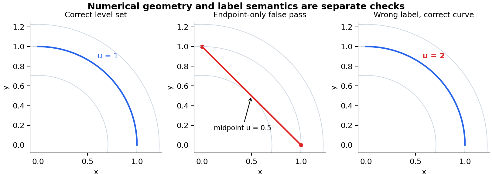
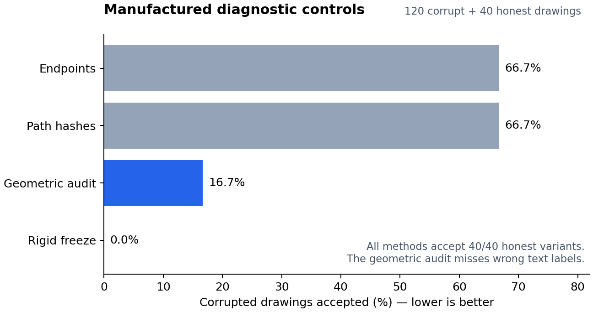
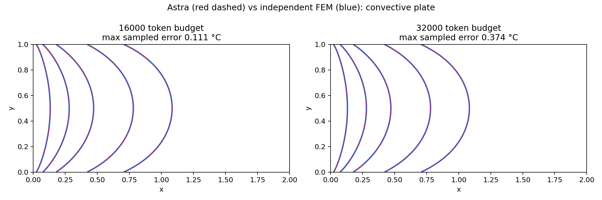

# Auditing Numerical Claims in Editable Engineering SVGs

**Working manuscript for a prospective CVPR 2027 submission.** The results below are implementation controls and an exploratory re-audit. They do not yet establish a complete research contribution. Main benchmark experiments, drafting assessment and author review remain outstanding. This document is not formatted as a final conference submission.

## Abstract

Scientific vector drawings can be syntactically valid and visually plausible while making incorrect numerical claims. Editing introduces further failure modes: changing an ancestor transform can alter a contour without changing its path string, and editing a text label can falsify a drawing while preserving every curve. We study the interface between a numerical solution and its editable SVG representation. We implement a sampled contour audit with ancestor transforms, arc-length weighting, required-level coverage and explicit unsupported-reference status, and examine a restricted editing policy that separates presentation changes from physical changes requiring a new solve. On 160 manufactured controls, the geometric audit accepts 20 of 120 corrupted drawings, all with wrong text labels; a rigid document-freeze baseline accepts none. Re-auditing six historical generated drawings gives three strict geometric passes, with the remaining cases exposing corner-reference ambiguity, masked boundary coverage and an empty model response. These findings motivate joint geometric and semantic checking, but also show why numerical checks or constrained editing alone are insufficient novelty claims. A small synthetic training pilot validates the implementation pipeline; a perfect template-rule baseline limits what its neural scores can demonstrate.

## 1. Introduction

An engineering drawing is both an image and a collection of claims. A curve labeled as an isotherm asserts that the temperature along the curve equals a specified value. A stress legend asserts that its colors refer to a particular derived quantity and unit. An edit that preserves appearance can violate these assertions, while an edit that changes appearance can preserve them exactly.

Recent systems already use language models to formulate and execute simulations, generate scientific vector graphics, and modify editable diagrams. The research problem is therefore not whether an LLM can call a solver or output SVG. The question is whether the final editable artifact remains consistent with the numerical solution it purports to depict, particularly after a sequence of natural-language edits.

We distinguish three questions. First, does the numerical solution adequately approximate the specified physical model? Second, does the displayed geometry agree with that solution within a stated numerical tolerance? Third, do the drawing's labels, units, legends and visibility agree with the intended claims? A successful solver invocation addresses neither of the latter two automatically. A low contour error does not establish semantic or visual correctness.

The current work provides an implementation and diagnostic evidence for this separation. The proposed submission must additionally establish that a solver-linked representation improves useful editing under a strong deterministic and prompting baseline, at comparable drafting quality. Without that evidence, the contribution is a useful engineering audit rather than a demonstrated new computer-vision method.

## 2. Related work and positioning

**Language-driven simulation.** MechAgents uses collaborating language-model agents to write, execute and correct mechanics simulations. Its examples include corrections to the plotted stress quantity, making it directly relevant to the problem of simulation-to-figure fidelity [1]. MCP-SIM maps natural-language problems into simulation workflows through clarification, execution and feedback [2]. We build on this workflow concept rather than claiming the first LLM/solver integration. Reproduction remains necessary: inspected MCP-SIM code lacks some imported utilities and orchestration/dependency files, and MechAgents examples depend on older software versions. These observations concern the available releases, not the validity of private paper experiments.

**Scientific vector generation and editing.** SSVG-Bench and LOOP evaluate structural properties of generated scientific graphics [3]. AutoFigure-Edit provides editable scientific illustrations and an SVG editing interface [4]. SciDiagramEdit studies instruction-driven revisions to scientific vector sources and execution-trace-based skill evolution [5]. SVGEditBench V2 evaluates general SVG editing [6]. These works rule out broad claims to introduce structural evaluation or instruction-based scientific SVG editing. A prospective contribution should show benefits on numerical field claims and sequential physical edits that their original benchmarks do not measure.

**Semantic constraints.** Penrose separates mathematical content from visual styling and optimizes diagram layout under constraints [7]. This motivates separating immutable physical meaning from editable presentation. A numerical contour, however, also requires a solution record, physical-coordinate mapping and explicit approximation error. A useful baseline is a deterministic solver plot with frozen geometry and templated labels: it may preserve claims perfectly while offering limited layout flexibility.

**Learned simulation and preference training.** PINNs and text-conditioned physics models are established alternatives for approximating fields [8,9]. Their approximation and training costs must be distinguished from the cost of drafting a figure. SciForma studies scientific methodology diagrams with component, arrow and text objectives [10]. Its diffusion renderer is adjacent to this task but is not a native SVG/PDE baseline. We do not train a PINN simply to supply a neural component when a conventional solver already provides the required reference.

The literature review is targeted rather than exhaustive. We have not established that no prior work implements the entire proposed representation. The defensible claim must be narrowed after reproducing the closest available systems.

The follow-up FEM survey adds important direct precedents. FEABench [17] evaluates end-to-end COMSOL operation; FEM-Bench [12] tests FEM functions and generated tests; ALL-FEM [13] already fine-tunes models on verified FEniCS programs and uses feedback-driven agents. PDEAgent-Bench [14] evaluates numerical accuracy and efficiency across PDE families and FEM libraries. OASiS [16] provides multi-solver tooling and verification, while VFEAgent [15] addresses image/text-to-FEA workflows. These works preclude novelty claims based merely on solver calling, engineering-code fine-tuning, or adding multimodal input. Our prospective contribution must concern the correctness and usefulness of the final editable graphical artifact, with direct comparisons and evidence still required.

## 3. Problem formulation

Let a physical problem be specified by domain geometry Ω, governing equation P, boundary conditions B, material parameters θ and quantity q. A numerical solution record R stores these inputs together with solver version, mesh or grid, units, convergence diagnostics and an identifier. Let $u_R$ be its scalar field and $D$ an SVG drawing associated with $R$.

A contour claim consists of an SVG element identifier, a declared field level c, a quantity and unit, and a mapping from SVG coordinates to physical coordinates. The complete claim also includes its associated label and legend entry. A physical input edit produces a new problem and must invalidate the association with R until a new solution is available. A presentation edit should preserve the claims while changing only their visual arrangement or permitted style.

For a sampled contour with physical points $x_i$ and arc-length weights $w_i$, define the mean normalized geometric error as

$$
E_{\mathrm{mean}} = 100\,\frac{\sum_i w_i\,|u_R(x_i)-c|}{\operatorname{range}_R\,\sum_i w_i}.
$$

We also report the maximum sampled error, required-level coverage, invalid-reference samples and unsupported rendering features. The field range is explicitly specified by the benchmark; it is not inferred differently for each edited output. A strict pass requires every required level, valid support for all checked samples, no flagged unsupported condition, and maximum sampled error below the stated tolerance.

This is a numerical audit, not a mathematical certificate. Finite sampling cannot prove correctness between samples. Reference interpolation has its own approximation error. Unsupported points must not silently disappear from a pass/fail denominator.

## 4. Implementation

### 4.1 Geometric audit

The previous local evaluator could reduce straight segments and arcs to their endpoints. For `u(x,y)=x²+y²`, the chord from (1,0) to (0,1) has endpoint value 1 at both ends but midpoint value 0.5. An endpoint test can therefore report zero error for a visibly and numerically incorrect level set.

The repaired evaluator parses SVG paths, including arcs and reflected curve controls, and composes ancestor and local transforms. For Bezier segments, a derivative-control-point bound determines a sampling interval; arcs use a radius/angle bound and the affine operator norm. Samples include segment endpoints and never introduce bridges between disconnected subpaths. Chord-length quadrature approximates arc-length weighting.

Bilinear interpolation retains out-of-domain or masked samples as invalid coverage. A masked corner with exactly zero interpolation weight is not treated as a contributing value. Missing levels, malformed geometry and explicitly unsupported dynamic or rendering features prevent a strict geometric pass. The implementation always reports that a full drawing has not been verified.

### 4.2 Restricted editing policy

The pilot executor owns the generated SVG and exposes a small action schema: visible contour color, bounded stroke width, moving a bound label within an annotation panel, routing a changed physical boundary for recomputation, or rejecting a misleading request. The policy model receives a compact DOM index and produces one JSON action. It does not generate the numerical contour paths.

The executor rejects geometry, level and transform mutations through this interface. Label text remains bound to the stored contour. A recomputation action returns a pending solver request and never certifies the old field as a new solution. This implementation supports only its generated schema, not arbitrary user SVGs.

Crucially, the executor does not understand the instruction. A model can choose a permitted action that does not fulfill the request. Thus we evaluate exact action fulfillment separately from executor acceptance and from geometry preservation. Arbitrary occlusion, label collision, legend consistency and complete SVG rendering semantics remain outside this pilot.

## 5. Diagnostic experiments

### 5.1 Manufactured corruption controls

We generate 20 quarter-circle contour cases in the quadratic field `u=x²+y²`. Each case has two honest variants (unchanged and recolored) and six corruptions: replace an arc with its chord, translate an ancestor, change the declared level, hide the contour, remove it, or falsify its text label. All cases are simple implementation controls with known construction; they are not samples of natural model failures.

| Checker | Honest accepted, n=40 | Corrupt accepted, n=120 |
|---|---:|---:|
| Endpoint/local-coordinate control | 40/40 | 80/120 |
| Path-string hash protection | 40/40 | 80/120 |
| Repaired geometric audit | 40/40 | 20/120 |
| Rigid freeze except contour color | 40/40 | 0/120 |

The numerical audit's remaining false accepts are all wrong-label cases. This demonstrates the need for semantic checks; it does not demonstrate superiority over the rigid baseline. The proposed method must retain useful editing flexibility beyond the narrow recoloring task to justify its additional complexity.

### 5.2 Exploratory historical re-audit

We re-score six pre-existing v3 generation attempts using a maximum sampled error threshold of 0.5 percentage points of the specified field range. The outputs and references were fixed before this repair. The threshold and revised audit are exploratory, not a prospectively preregistered evaluation.

| Attempt | Mean / maximum error, pp | Strict geometric outcome |
|---|---:|---|
| L-shaped Laplace | 0.3537 / 80.0000 | Does not pass; incompatible-corner issue |
| Square torsion | 0.0701 / 0.3330 | Pass |
| Plate with square hole | 0.0693 / 0.2677 | Pass |
| Channel step streamlines | 0.0140 / 0.2459 | Pass |
| Square conductor in shell | 0.2167 / 0.3791 | Does not pass; 1,528 unsupported reference samples |
| Convective-edge plate | Not available | Empty response; counted as attempted |

The L-shaped case's largest errors occur at discontinuous/incompatible corner boundary data. The shell's unsupported points occur on boundary contours intersecting the raster reference mask, while its required interior contours have valid support. These cases must not be indiscriminately labeled incorrect model physics. A boundary protocol and reference convergence study are needed. Full-domain results and any prespecified exclusions should be reported together.

### 5.3 Neural training pilot

The pilot contains 60 training physical cases with six edits each, and 10 cases each for validation, test and held-out annuli. The rectangular field is solved by finite differences and checked against the analytic linear-temperature solution. The annular field uses the analytic radial Laplace solution. All edit variants of a physical case remain in one split.

We train attention-projection LoRA adapters on Qwen2.5-Coder-1.5B-Instruct [11], with rank 16, scale 32 and dropout 0.05. The A100 configuration uses FP16 frozen weights, microbatches of four and three accumulation steps, with three fixed epochs and seeds 17, 29 and 41. The loss masks prompt tokens. Final checkpoints are fixed by epoch count; held-out scores do not choose the model.

Evaluation retains every raw generation and counts every attempted example. Strict JSON exact-action accuracy is reported alongside a sensitivity score that removes only a single enclosing Markdown JSON fence. Multiple objects, incomplete JSON and explanations are not selectively parsed into a favorable action. This distinction was added after inspecting formatting failures in the interrupted T4 diagnostic, and is therefore a disclosed post-hoc diagnostic there and a specified measure for the subsequent A100 runs.

All three A100 runs completed three epochs and 90 optimizer steps; locally saved adapters, checkpoints and raw generations were verified. Each final adapter obtains 60/60 strict exact actions on both evaluation splits. The base obtains 0/60 under strict JSON parsing and 26/60 (test) and 25/60 (annulus) after removing one enclosing JSON fence. The deterministic template parser obtains 60/60 on both splits. Consequently these results validate the training pipeline and do not establish a benefit from learning. See `../reports/TRAINING_RESULTS.md` for configuration, recovery provenance and limitations.

### 5.4 Direct API and FEM recheck

Four new direct OpenAI Astra calls revisit the convective plate, capacitor and bracket. Both Robin calls now return contours and finish normally, including the 16,000-token condition that previously returned nothing. One sample per condition does not estimate reliability or isolate a budget effect. Direct evaluation in an independent P2 FEM field gives mean/maximum errors of 0.00702/0.11074 °C for the 16,000-token condition and 0.01247/0.37385 °C for 32,000 tokens. The final FEM mesh has 147,456 triangles; its difference from the preceding mesh is below 0.008 °C at sampled contour points. Both drawings pass the existing 0.5 °C sampled geometric threshold. This does not separately certify boundary angles or all rendered semantics.

Inspection also corrects a qualitative claim in an older report: the historical capacitor contains twelve open electric-field paths joining conductors, not closed field loops, and labels the end contours schematic. The bracket explicitly marks its stress map as illustrative and identifies the need for geometry and restraint assumptions before asserting a converged peak. These observations narrow the evidence: a past completion failure is real, but these cases do not establish three general classes of FEM incapability. Full evidence and protocol are in `../reports/ASTRA_FEM_FAILURE_RECHECK.md`.

### 5.5 Reuse of an existing FEM benchmark

We begin extending FEM-Bench [12] by importing its unchanged MIT-licensed axial-bar solver at a pinned commit. Both upstream reference tests pass. Twelve generated cases and twelve load-edited cases produce twenty-four actual FEM solves with analytic-displacement and force-balance checks, numerical records and corresponding SVGs. This replaces a routing-only demonstration with a real physical recomputation in one elementary anchor. It is not a reproduction of FEM-Bench's full evaluation, a new benchmark result, or evidence of a learned editing advantage.

## 6. Main study still required

The intended main study should compare direct SVG editing, solver-informed unrestricted editing, protected geometry, joint geometric/semantic protection, and deterministic solver plotting under the same cases and instructions. Useful metrics include required-contour coverage, field error, wrong quantity/unit rates, edit success, disclosure and rejection correctness, render validity, drafting quality and latency. Geometry-family and instruction-template holdouts should be distinct evaluations.

At least three genuine numerical families should be included after reference validation, such as Robin heat transfer, finite-domain electrostatics and elasticity around a hole. Physical parameter edits must trigger an actual solve. Multi-step sequences should test whether prior protections survive later layout and semantic changes. Honest counterfactuals are needed: a request to change a label to its already-correct value should not be rejected merely because it contains a relabeling verb.

Uncertainty should be computed over physical cases, not treated as if six related edit variants were independent. Multiple training seeds, compute accounting, mesh convergence, complete denominators and qualitative failure inspection are necessary. Blinded drafting assessment is needed to show the tradeoff between safety and useful visual flexibility.

## 7. Limitations and responsible interpretation

The present implementation does not establish full visible-figure correctness or universal physical truth. Some SVG features are explicitly unsupported; others, including arbitrary text semantics and occlusion, are outside the geometric metric. Hashing a solution record establishes identity, not that the solution is accurate or honestly computed.

The manufactured controls are selected examples of vulnerabilities and should not be used as an estimate of real-world prevalence. The historical study is small and exploratory. The pilot task is templated, language-only and solvable by a simple parser. There is no evidence here that a neural editor outperforms a strong deterministic system in useful drafting. These limitations determine the remaining experiments rather than being hidden behind aggregate success rates.

## References

[1] Ni and Buehler. *MechAgents: Large Language Model Multi-Agent Collaborations Can Solve Mechanics Problems, Generate New Data, and Integrate Knowledge.* https://arxiv.org/abs/2311.08166 . Author code: https://github.com/lamm-mit/MechAgents .

[2] Park, Moon and Ryu. *MCP-SIM.* npj Artificial Intelligence, 2026. https://www.nature.com/articles/s44387-025-00057-z . Author code: https://github.com/KAIST-M4/MCP-SIM .

[3] *Towards the Generation of Structured Scientific Vector Graphics with Large Language Models.* Inspected manuscript labeled under review; acceptance unverified. https://openreview.net/pdf?id=aWypD2TAaC .

[4] *AutoFigure-Edit.* ACL System Demonstrations, 2026. https://aclanthology.org/2026.acl-demo.6/ .

[5] *SciDiagramEdit.* Preprint, 2026. https://arxiv.org/abs/2607.15272 .

[6] *SVGEditBench V2.* https://arxiv.org/abs/2502.19453 .

[7] *Penrose.* SIGGRAPH, 2020. https://penrose.ink/media/Penrose_SIGGRAPH2020.pdf .

[8] Raissi et al. *Physics-informed neural networks.* Journal of Computational Physics, 2019. https://www.sciencedirect.com/science/article/pii/S0021999118307125 .

[9] *Text2PDE.* https://arxiv.org/abs/2410.01153 .

[10] *SciForma.* Preprint, 2026. https://arxiv.org/abs/2607.18091 .

[11] Qwen. *Qwen2.5-Coder-1.5B-Instruct.* https://huggingface.co/Qwen/Qwen2.5-Coder-1.5B-Instruct .

Bibliographic entries are working source pointers. Verify complete author lists, titles, publication status and BibTeX metadata before submission.

[12] Mohammadzadeh, Hamdi, Shor and Lejeune. *FEM-Bench: A Structured Scientific Reasoning Benchmark for Evaluating Code-Generating LLMs.* https://arxiv.org/abs/2512.20732 . Code: https://github.com/elejeune11/FEM-bench .

[13] Deotale et al. *ALL-FEM: Agentic Large Language Models fine-tuned for finite element methods.* Computer Methods in Applied Mechanics and Engineering 457:118985, 2026. https://doi.org/10.1016/j.cma.2026.118985 . Author project: https://fenics-llm.github.io/ .

[14] *PDEAgent-Bench: A Multi-Metric, Multi-Library Benchmark for PDE Solver Generation.* 2026. https://arxiv.org/abs/2605.09636 .

[15] Zhang et al. *VFEAgent: A Multimodal Agent Framework for End-to-End Automated Finite Element Analysis.* Preprint, 2026. https://arxiv.org/abs/2605.28978 .

[16] Hermann, Shojaei, Scheider and Cyron. *OASiS: an open-source multi-physics and multi-code framework for verified computer simulations.* Software, 2026. https://github.com/Hereon-InstituteMS/OASiS .

[17] Mudur et al. *FEABench: Evaluating Language Models on Multiphysics Reasoning Ability.* https://arxiv.org/abs/2504.06260 .
