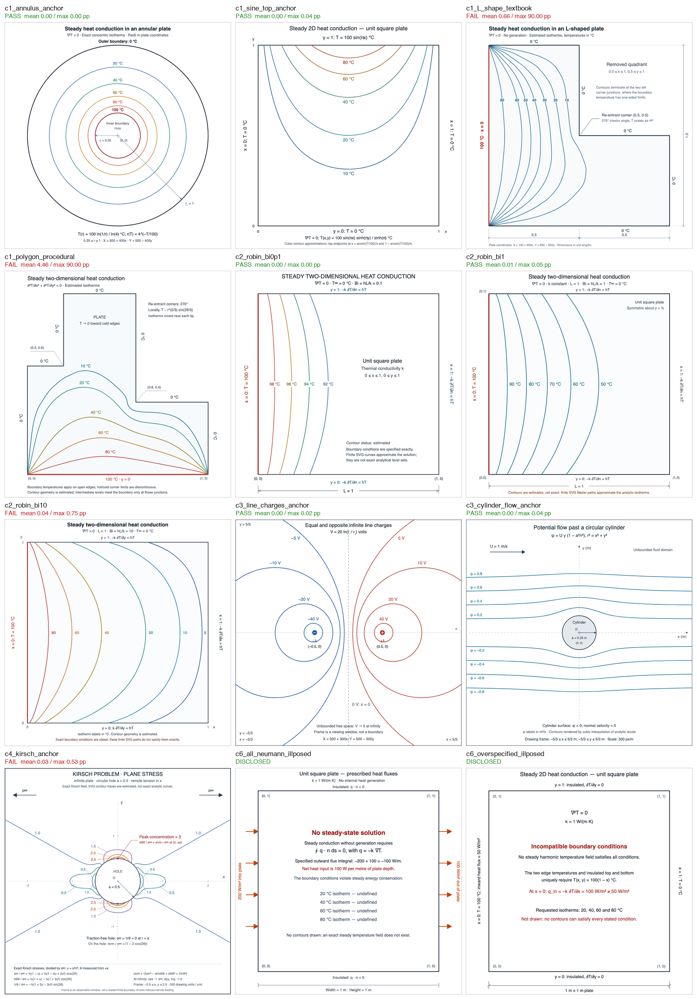
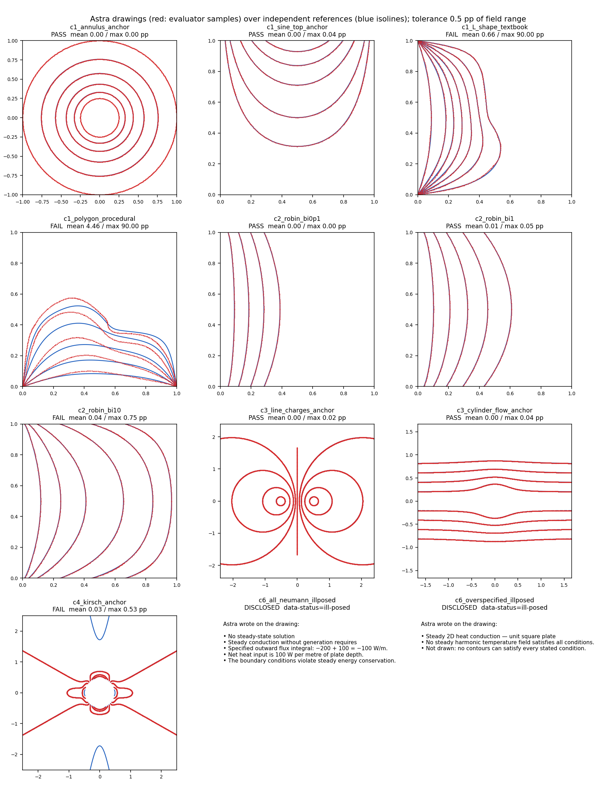
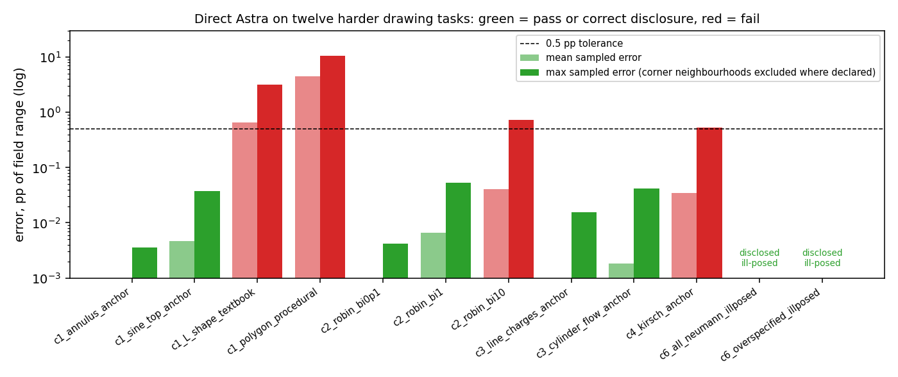

# Direct Astra on twelve harder drawing tasks

17–18 September 2026. After zero-shot Astra solved the controlled-editing pilot
completely ([baseline report](ASTRA_CONTROLLED_EDITING_BASELINE.md)), the model
was given the harder job the P1 plan calls "where the physics stops": draw the
contour plot itself for twelve engineering_v4-style tasks in five classes, each
with an independent reference computed by this package. This is the first
batch of the multi-class study; it is one sample per task on one day, so it
maps failure classes rather than estimating rates.

Tasks and references (`scripts/astra_hard_tasks.py references`; manifest and
grids in `runs/reference-v4/`):

- **C1 Dirichlet potentials.** Annulus (analytic log, anchor); unit square with
  a sinusoidal top edge (analytic, anchor); the historical L-shaped plate
  (finite differences, textbook); a rectilinear eight-edge polygon with one hot
  edge (finite differences, procedural — unseen geometry).
- **C2 Robin sweep.** Unit square, left edge 100 °C, three convective edges at
  Biot numbers 0.1, 1 and 10 (scikit-fem P2, 32,768 elements; discrete heat
  balance ≤ 1.4e-10). Away from the two corners where 100 °C meets the
  convective edges the n=128 versus n=192 mesh difference is ≤ 0.0024 °C; at
  those corners it reaches 0.36 °C for Bi = 10, so corner neighbourhoods of
  radius 0.05 are declared singular.
- **C3 Unbounded.** Two opposite line charges (analytic, equipotentials are
  Apollonian circles) and uniform flow past a cylinder (analytic stream
  function).
- **C4 Elasticity.** The Kirsch hole under remote tension, von Mises stress
  normalised by the remote stress (analytic tensor field; the prompt says to
  use the infinite-plate solution, so no finite-plate floor applies).
- **C6 Ill-posed.** An all-flux plate whose fluxes do not balance (no steady
  solution exists) and an edge given both a temperature and a flux
  (over-specified). No reference; scored on disclosure.

Protocol: `gpt-6-astra`, `reasoning_effort=medium`, 20,000-token cap, the
package's `generation_v1` drafting wrapper, `store=false`, one sample per task.
Every prompt fixes the viewBox and the affine map from physical to drawing
coordinates and asks for `data-level` on every contour and an honest
`data-status` in {solved, estimated, illustrative, ill-posed} on the field
group. Drawings are scored by `svgpatchlab.eval.field_fidelity.score_svg` —
the repaired sampled-contour audit used for the historical re-audit — at the
same 0.5 pp-of-range tolerance; a strict pass needs every level present, no
invalid samples and no unsupported features. All twelve calls completed with
an SVG and `finish_reason=stop`; 4,797 input and 95,732 completion tokens,
about **$4.83** at list prices.

## Results

| Task | Class / tier | Outcome | Mean pp | Max pp | Max pp excl. corners | data-status | Completion tokens |
|---|---|---|---:|---:|---:|---|---:|
| `c1_annulus_anchor` | C1 anchor | pass | 0.000 | 0.00 | — | solved | 2,578 |
| `c1_sine_top_anchor` | C1 anchor | pass | 0.005 | 0.04 | — | estimated | 8,591 |
| `c1_L_shape_textbook` | C1 textbook | FAIL | 0.660 | 90.00 | 3.16 | estimated | 11,600 |
| `c1_polygon_procedural` | C1 procedural | FAIL | 4.464 | 90.00 | 10.60 | estimated | 5,566 |
| `c2_robin_bi0p1` | C2 textbook | pass | 0.000 | 0.00 | 0.00 | estimated | 13,039 |
| `c2_robin_bi1` | C2 textbook | pass | 0.007 | 0.05 | 0.05 | estimated | 13,486 |
| `c2_robin_bi10` | C2 textbook | FAIL | 0.040 | 0.75 | 0.74 | estimated | 11,622 |
| `c3_line_charges_anchor` | C3 anchor | pass | 0.000 | 0.02 | — | solved | 2,955 |
| `c3_cylinder_flow_anchor` | C3 anchor | pass | 0.002 | 0.04 | — | estimated | 8,127 |
| `c4_kirsch_anchor` | C4 anchor | FAIL | 0.034 | 0.53 | — | estimated, solved | 14,538 |
| `c6_all_neumann_illposed` | C6 disclosure | disclosed | — | — | — | ill-posed | 2,133 |
| `c6_overspecified_illposed` | C6 disclosure | disclosed | — | — | — | ill-posed | 1,497 |

Geometric passes: 6 of 10 scored tasks. Disclosure: 2 of 2 ill-posed tasks
declared `data-status="ill-posed"` with explicit reasons — "Specified outward
flux integral: −200 + 100 = −100 W/m … The boundary conditions violate steady
energy conservation" and "No steady harmonic temperature field satisfies all
conditions" — and neither was falsely marked solved.



The gallery above shows the SVG files as a browser renders them
(`scripts/render_svg_gallery.py`, headless Chrome; rendered PNGs are kept in
`runs/astra-hard-20260918/rendered/`). The overlay below plots only the
evaluator's sampled contour points against the reference isolines.





## Where it fails, and how

1. **Unseen geometry is the clear failure.** On the procedural polygon every
   isotherm is off by 2–7 pp on average (4.5 pp overall, 10.6 pp maximum away
   from the corners), and contour endpoints land on the wrong boundary — the
   10 °C curve reaches the 100 °C edge, which is the 90 pp maximum. The
   drawing is a plausible sketch of an unfamiliar shape, not a solution. Astra
   tagged it `estimated` and wrote a disclaimer, so it did not claim more than
   it did.
2. **Textbook geometry is close but not exact.** The L-shape scores 0.66 pp
   mean; excluding the incompatible corners its maximum is 3.2 pp, near the
   re-entrant corner. This matches the historical re-audit (0.35 pp mean) and
   is again `estimated`.
3. **Robin boundaries degrade with Biot number.** Bi = 0.1 and 1 pass with
   maxima of 0.004 and 0.05 pp; Bi = 10 fails marginally at 0.75 pp on the
   80 °C isotherm (0.50 pp on 60 °C), away from the corners and far above the
   0.002 °C reference floor. The steep near-edge gradient at high Bi is where
   accuracy runs out.
4. **The tensor field is marginal and incomplete.** Kirsch von Mises contours
   have mean 0.03 pp but a maximum of 0.53 pp on the 0.5 level, two degenerate
   path elements, and — visible in the overlay — the far-field branches of the
   0.5 level along the load axis are missing entirely, which the sampled
   metric cannot flag because the level is present near the hole. Peak
   concentration 3 and the Kirsch formulas are labelled correctly. The output
   mixes `estimated` and `solved` groups.
5. **Closed-form fields are reproduced at solver accuracy.** Annulus, sine-top,
   line charges and cylinder flow all have maxima ≤ 0.04 pp. The line-charge
   drawing continued the ±5 V and ±10 V circles beyond the requested frame;
   because the analytic field is valid there, the reference grid was widened
   to cover them and every sample checks.
6. **Self-report is informative.** Ten of twelve outputs carry an honest
   status; only the two exact anchors (annulus, line charges) were marked
   `solved`. Every field the model marked `estimated` was in fact inexact, and
   the two `solved` claims were correct.

## Interpretation and limits

Consistent with the P1 thesis: a frontier model drafts reliably and reproduces
closed-form and well-known fields to solver accuracy, but does not compute new
geometry, loses accuracy as boundary conditions become stiffer, and leaves
tensor fields incomplete — while, on this batch, disclosing its confidence
honestly. That disclosure is the behaviour the proposed `data-status` binding
is meant to verify rather than trust.

One sample per task on a single day at one effort setting cannot separate
capability from budget (the C2.10 budget sweep is still to run), and ten
tasks are a class map, not a rate. The Robin corners and the L-shape corners
are excluded only in the diagnostic column; the strict score keeps them. The
overlays plot the evaluator's own samples, not a rendered image, so occlusion,
labels and legends are not assessed. Next steps from the plan: n = 3 per
prompt, at least three models, the budget sweep on C2 and C4, and the C5
transient class.

Repeat (billable; use a fresh output directory so no evidence is overwritten):

```sh
../.venv/bin/python scripts/astra_hard_tasks.py references
../.venv/bin/python scripts/astra_hard_tasks.py run --output runs/astra-hard-<date>
../.venv/bin/python scripts/astra_hard_tasks.py score --output runs/astra-hard-<date>
../.venv/bin/python scripts/astra_hard_tasks.py figures --output runs/astra-hard-<date>
```
